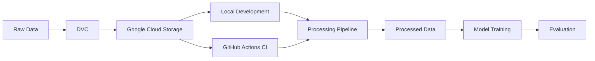

# Corrupt MNIST MLOps Project

Welcome to the documentation for the Corrupt MNIST MLOps project. This project demonstrates a complete end-to-end machine learning operations (MLOps) pipeline for image classification using a corrupted version of the MNIST dataset.

## Project Overview

This project implements a production-ready machine learning system that addresses the challenges of:

- **Data versioning and management** using DVC (Data Version Control)
- **Cloud storage integration** with Google Cloud Storage
- **Reproducible data processing** pipelines
- **Automated testing** in CI/CD workflows
- **Distributed data access** across development and production environments

## What is Corrupt MNIST?

Corrupt MNIST is a harder variant of the classic MNIST handwritten digits dataset. It introduces various types of corruption and noise to make the classification task more challenging and realistic, simulating real-world data quality issues.

**Dataset Characteristics:**

- **Training samples**: 30,000 images
- **Test samples**: 5,000 images
- **Image dimensions**: 28×28 pixels (grayscale)
- **Classes**: 10 (digits 0-9)
- **Corruptions**: Various noise patterns, occlusions, and distortions

## Key Features

### Data Management

- **DVC Integration**: Version control for large datasets
- **Cloud Storage**: Data hosted on Google Cloud Storage
- **Efficient Caching**: GitHub Actions cache for CI/CD workflows
- **Preprocessing Pipeline**: Automated normalization and formatting

### Development Workflow

- **Python 3.12+**: Modern Python with type hints
- **UV Package Manager**: Fast, reliable dependency management
- **Pre-commit Hooks**: Automated code quality checks
- **Testing**: Comprehensive pytest suite

### CI/CD

- **Multi-platform Testing**: Ubuntu, Windows, and macOS
- **Multi-version Support**: Python 3.12 and 3.13
- **Automated Data Retrieval**: DVC pull in GitHub Actions
- **Service Account Authentication**: Secure GCP access

## Quick Start

### Prerequisites

- Python 3.12 or higher
- `uv` package manager
- Google Cloud credentials (for data access)

### Installation

```bash
# Clone the repository
git clone https://github.com/brunozorrilla/corrupt-mnist.git
cd corrupt-mnist

# Install dependencies
uv sync

# Pull data from cloud storage
uv run dvc pull
```

### Run Data Processing

```bash
# Process raw data into training-ready format
uv run python src/corrupt_mnist/data.py
```

### Run Tests

```bash
# Execute test suite
uv run pytest tests/
```

## Documentation Structure

This documentation is organized into the following sections:

### [Data Management](data/overview.md)

Comprehensive guide to the data infrastructure:

- **[Overview](data/overview.md)**: Introduction to the data management approach
- **[Data Structure](data/structure.md)**: File organization and formats
- **[Processing Pipeline](data/processing.md)**: Data transformation workflow
- **[DVC Setup](data/dvc-setup.md)**: Version control configuration
- **[Local Access](data/local-access.md)**: Working with data locally
- **[CI/CD Integration](data/ci-cd.md)**: Automated data access in workflows

## Architecture Overview



## Project Structure

```
corrupt-mnist/
├── .github/
│   └── workflows/
│       └── tests.yaml          # CI/CD configuration
├── data/
│   ├── raw/                    # Raw dataset files
│   └── processed/              # Processed, ready-to-use data
├── src/
│   └── corrupt_mnist/
│       ├── data.py             # Data loading and processing
│       ├── model.py            # Model architecture
│       ├── train.py            # Training pipeline
│       └── evaluate.py         # Evaluation metrics
├── tests/                      # Test suite
├── docs/                       # Documentation (this site)
├── mkdocs.yml                  # Documentation configuration
├── pyproject.toml              # Project dependencies
└── data.dvc                    # DVC tracking file
```

## Technologies Used

| Category            | Technology           | Purpose                       |
| ------------------- | -------------------- | ----------------------------- |
| **Language**        | Python 3.12+         | Core programming language     |
| **Package Manager** | UV                   | Fast dependency management    |
| **ML Framework**    | PyTorch              | Neural network implementation |
| **Data Versioning** | DVC                  | Dataset version control       |
| **Cloud Storage**   | Google Cloud Storage | Remote data hosting           |
| **Testing**         | Pytest               | Unit and integration tests    |
| **CI/CD**           | GitHub Actions       | Automated testing pipeline    |
| **Documentation**   | MkDocs Material      | This documentation site       |
| **Code Quality**    | Ruff, Pre-commit     | Linting and formatting        |

## Contributing

This is an academic exercise project demonstrating MLOps best practices. Key principles:

1. **Reproducibility**: All experiments should be reproducible
2. **Documentation**: Code and processes are thoroughly documented
3. **Testing**: Changes include appropriate tests
4. **Version Control**: Data and code are properly versioned

## License

See [LICENSE](../LICENSE) for details.

## Contact

**Author**: Bruno Zorrilla

For questions or feedback about this academic project, please open an issue on the GitHub repository.
